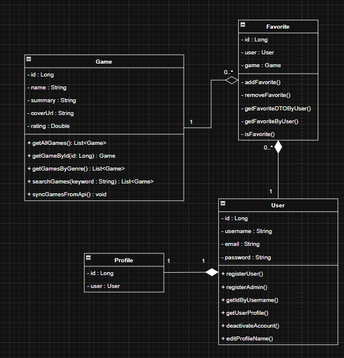
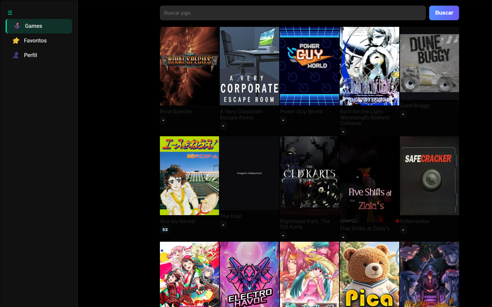
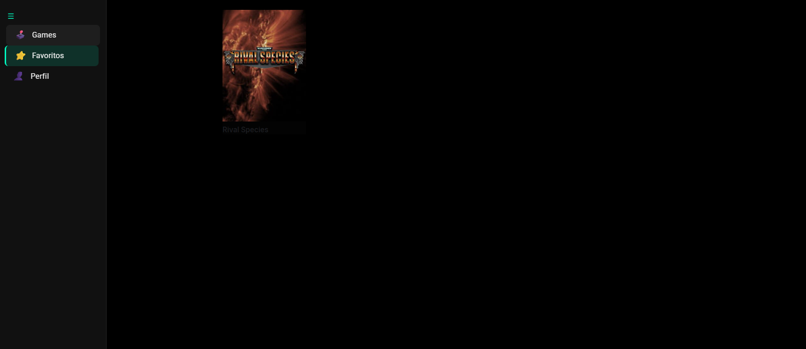

# GameList

Um sistema para gerenciamento de listas de jogos, inspirado em sites de ROMs, mas sem downloads de jogos, apenas informações e organização de títulos.

O projeto segue o padrão MVC, com **Spring Boot (Java)** no backend, **Angular** no frontend e **MySQL** como banco de dados, além de integração com a API externa **IGDB** para busca de informações sobre os jogos.  
Toda a aplicação é orquestrada com **Docker Compose**.

---

## Diagrama de Classes



---

## Telas da aplicação
### Lista de jogos


### Lista de favoritos


---

## Tecnologias Utilizadas

### Backend
- Java 21
- Spring Boot
- Spring Security + JWT
- MySQL
- API Externa: [IGDB](https://api-docs.igdb.com/)

### Frontend
- Angular
- TypeScript / HTML / CSS

### Infraestrutura
- Docker e Docker Compose
- Postman (para testes de requisição)

---

## Funcionalidades
- Cadastro e login de usuários com autenticação JWT
- Perfis de usuário
- Listas personalizadas de jogos
- Favoritar jogos
- Pesquisa por nome de jogos
- Integração com API externa (IGDB)
- Controle de acesso por perfil
- Edição de nome de usuário
- Desativação da própria conta

---

## Segurança
- Autenticação stateless com JWT
- Filtros personalizados de segurança
- Proteção de rotas no backend (Spring Security)
- Guards e interceptors no frontend (Angular)

---

## Estrutura do Projeto (MVC + Angular)

```text
├── src/
│   ├── main/java/com/gamelist/
│   │   ├── controller/         # Camada de controle (endpoints REST)
│   │   ├── service/            # Regras de negócio
│   │   ├── model/              # Entidades JPA
│   │   ├── repository/         # Acesso ao banco
│   │   └── config/             # Segurança, CORS, etc
│   ├── main/resources/
│   │   └── application.properties
│   └── test/
│
├── frontend/
│   ├── src/
│   │   ├── app/
│   │   │   ├── pages/          # Páginas principais ligadas às rotas
│   │   │   ├── components/     # Componentes reutilizáveis da interface
│   │   │   ├── layouts/        # Estruturas de layout
│   │   │   ├── services/       # Comunicação com a API
│   │   │   ├── models/         # Interfaces e modelos de dados
│   │   │   ├── guards/         # Proteção de rotas
│   │   │   └── auths/          # Autenticação e interceptors
│   │   ├── environments/       # Variáveis de ambiente
│   │   └── assets/             # Arquivos estáticos
│   ├── angular.json
│   ├── package.json
│   └── tsconfig.json
│
├── docker-compose.yml
├── pom.xml
└── README.md
```

## Como rodar o projeto?
### Pré-requisitos
- Docker
- Docker Compose

### Execução
- Na primeira execução:
```
docker compose up --build
```
- Nas próximas execuções:
```
docker compose up -d
```

## API Externa (IGDB)
- Integração com a IGDB API para busca de informações dos jogos
- Autenticação via OAuth2 (Client-ID e Access Token da Twitch)
- O backend consome a API e entrega os dados tratados ao frontend

## Autor:
### Raul Guilherme
- Email(raulawp460@gmail.com)
- LinkedIn(https://www.linkedin.com/in/raul-guilherme-549030367/)

