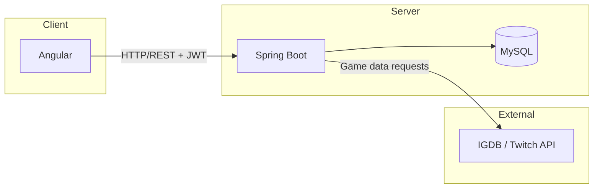

# GameList


> A game management and organization platform, inspired by ROM sites, but without game downloads — focused purely on information, discovery and personal organization of titles.

---

## Overview

GameList lets users search, favorite, comment on, and organize video games using real-time data from the IGDB API. It follows the classic MVC pattern on the backend, with a decoupled Angular frontend and JWT-based stateless authentication.

---

## Features

- **User Registration & Login** — JWT-based stateless authentication
- **User Profiles** — edit username, deactivate own account
- **Game Search & Discovery** — search games by name via the IGDB API
- **Favorites** — save games to a personal favorites list
- **Comments** — post, edit and delete comments on any game
  - Ownership validation (users can only edit/delete their own comments)
  - Admins can moderate (delete) any comment
- **Role-Based Access Control** — route and endpoint protection based on user role
- **Route Protection** — guards and interceptors on the frontend, filters and method security on the backend

---

## Tech Stack

| Layer | Technology |
|---|---|
| Backend | Java 21, Spring Boot, Spring Security, Spring Data JPA |
| Frontend | Angular (standalone components) |
| Database | MySQL |
| Auth | JWT |
| External API | IGDB (via Twitch OAuth2) |
| Infrastructure | Docker, Docker Compose |
| Testing Tools | Postman |

---

## Project Structure (MVC + Angular)

```
├── src/
│   ├── main/java/com/gamelist/
│   │   ├── controller/         # REST endpoints
│   │   ├── service/            # Business logic
│   │   ├── model/              # JPA entities
│   │   ├── repository/         # Database access
│   │   └── config/             # Security, CORS, etc
│   ├── main/resources/
│   │   └── application.properties
│   └── test/
│
├── frontend/
│   ├── src/
│   │   ├── app/
│   │   │   ├── pages/          # Route-linked pages
│   │   │   ├── components/     # Reusable UI components (navbar, sidebar, footer, comments, etc)
│   │   │   ├── layouts/        # Layout structures (visual organization and router-outlet)
│   │   │   ├── services/       # API communication and shared logic
│   │   │   ├── models/         # Data interfaces and models
│   │   │   ├── guards/         # Route protection (AuthGuard)
│   │   │   └── auths/          # Authentication, interceptors and session handling
│   │   ├── environments/       # Environment variables (dev/prod)
│   │   └── assets/             # Static files (images, icons)
│   ├── angular.json
│   ├── package.json
│   └── tsconfig.json
│
├── docker-compose.yml
├── pom.xml
└── README.md
```

## Getting Started

### Prerequisites

- Docker and Docker Compose installed
- A Twitch Developer account (for IGDB API access)

### Getting IGDB / Twitch Credentials (required)

IGDB authentication is done through Twitch OAuth2 (Client Credentials flow).

1. Create a free account at [dev.twitch.tv](https://dev.twitch.tv)
2. Go to **Applications → Register Your Application**
3. Fill in any name and category, set OAuth redirect URL to `http://localhost`
4. Copy the generated **Client ID** and **Client Secret**
5. Paste them into your `.env` as `TWITCH_CLIENT_ID` and `TWITCH_CLIENT_SECRET`

This takes about 2 minutes and requires no business verification.

### Setup

**1. Clone the repository**
```bash
git clone https://github.com/Raul-guii/GameList
cd GameList
```

**2. Create the `.env` file** in the project root:
```env
MYSQL_ROOT_PASSWORD=yourpassword
MYSQL_DATABASE=gamelist
MYSQL_USER=gamelistuser
MYSQL_PASSWORD=yourpassword
TWITCH_CLIENT_ID=your_twitch_client_id
TWITCH_CLIENT_SECRET=your_twitch_client_secret
JWT_SECRET=your_jwt_secret_min_32_chars
```

**3. Run**
```bash
docker compose up --build
```

That's it. No local Node.js or Java installation required.

### Access

| Service | URL |
|---|---|
| Frontend | http://localhost:4200 |
| Backend API | http://localhost:8080 |

---

## External API (IGDB)

- Integration with the IGDB API enables searching and retrieving detailed game information (name, cover, genres, rating, summary).
- Authentication is handled via OAuth2 Client Credentials flow using a Twitch Client ID and Access Token.
- The backend requests and caches the access token, then serves the treated data to the frontend.

---

## Architecture


```mermaid
flowchart LR
    subgraph Client
        A[Angular]
    end

    subgraph Server
        B[Spring Boot]
        C[(MySQL)]
    end

    subgraph External
        D[IGDB / Twitch API]
    end

    A -->|HTTP/REST + JWT| B
    B --> C
    B -->|Game data requests| D
```

---

## License

This project was developed as a personal portfolio project. Feel free to use it as reference.

## Contact

**Raul Guilherme** — [LinkedIn](https://www.linkedin.com/in/raul-guilherme-bezerra-da-silva-/) · [GitHub](https://github.com/Raul-guii) · [Email](raulawp460@gmail.com)

Feel free to reach out if you have questions about this project or want to discuss freelance opportunities.